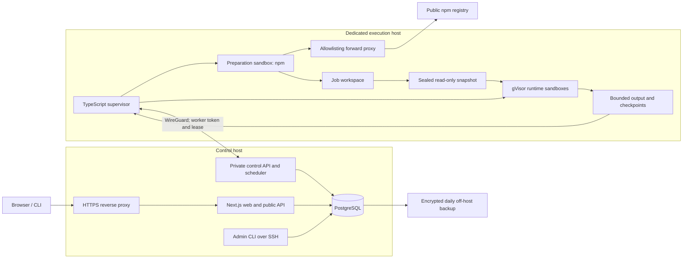

# CompatLab architecture and implementation plan

**Version:** 1.1 · **Updated:** October 3, 2026  
**Status:** Approved October 3, 2026; implementation follows the [fourteen-PR delivery plan](delivery-plan.md).

The [PRD v1.1](../compatlab_product_requirements_v1.1.md) defines product requirements. This document defines how to implement and verify them. [Research notes](research-notes.md) contain the supporting sources. The original PRD is retained as a historical archive, not a second specification. Implementation progress and test evidence belong in the delivery PRs; this architecture document does not certify an unbuilt or unqualified feature.

## 1. Architecture decisions

Build a TypeScript modular application with independently deployable execution workers. PostgreSQL stores catalog data, durable jobs, progress, bounded evidence, and reports. A small TypeScript supervisor drives Docker with gVisor. Preparation uses standard npm in its own sandbox; runtime tests use a sealed shared workspace with networking disabled.

Start with an anonymous public product and an independently useful open-source CLI. Add maintainer accounts, monitoring, and behavioral probes after the core reports prove useful. Keep account authentication, billing, Kubernetes, Redis, streaming progress, distributed tracing, and shared artifact storage out of the MVP.

| Concern | Initial choice | Why |
|---|---|---|
| Web and public API | Next.js, React, TypeScript; long-lived Node container | Server-rendered reports and one application toolchain |
| Application structure | Domain modules with explicit interfaces | Isolates behavior without splitting every module into a service |
| Contracts | Shared versioned TypeScript schemas with runtime validation | Rejects malformed requests/results; keeps CLI and website aligned |
| Database | PostgreSQL, Drizzle migrations/query layer; explicit SQL for claims | Constraints and transactions enforce identities and scheduling |
| Jobs | PostgreSQL rows, short `SKIP LOCKED` claim transactions, leases | Durable work without an additional broker |
| Execution | TypeScript supervisor, Docker CLI, gVisor/runsc | Documented integration and one language; small privileged dependency set |
| Package preparation | Pinned npm, scripts disabled, Squid allowlist proxy | Reuses maintained package handling and network controls |
| Storage | PostgreSQL for bounded data; worker disk for sealed workspaces | Fits the initial workload and preserves locality |
| Progress | Conditional HTTP polling every 2 seconds while active | Refresh/reconnect works from durable state |
| Operations | SSH-protected admin CLI, JSON logs, Sentry, off-host backups | Practical controls without a public admin application |
| Later login | Better Auth with GitHub; GitHub App for repository automation | Login and repository authority are separate concerns |

Pin supported releases and image digests during bootstrap; use a supported Node LTS for application services. Tested runtimes are separate configuration. Plan for Node 24 and 26, stable Bun, and stable Deno at launch. On October 3, Node 26 is still Current; its scheduled LTS promotion is October 28. Qualify it before treating it as an LTS baseline. A launch before promotion uses supported LTS alternatives. Node profiles are a list, not two named slots.

## 2. Components and trust boundaries



The existing VPS can host the control plane. Public untrusted preparation/execution must use a dedicated machine or separate VM boundary, with no production database or account secrets. Merely placing another ordinary Docker container beside PostgreSQL does not satisfy this separation. Exact host sizes remain a deployment check, as requested.

The web application and private control process share domain modules and database code. The control process provides job claims, heartbeat/result ingestion, aggregation, and scheduled reconciliation. Bind it only to the private interface; the public reverse proxy has no route to its endpoints. Workers initiate requests and have no database credentials. A per-worker random bearer token is stored as a hash centrally; revocation/draining happens through the admin CLI. WireGuard provides transport protection between hosts.

The supervisor is the only automated Docker-socket user on the execution host. Docker access is effectively host-root authority. No sandbox receives that socket, supervisor credentials, host environment, or arbitrary mount paths. The supervisor accepts only approved job types, image digests, bounded plans, and server-issued identifiers. It builds Docker argument arrays without a shell. Paths derive from private job directories, never user strings.

Domain modules cover registry resolution, admission, preparation, analysis/planning, execution, classification, reports, and operations. Runtime adapters supply flags and resolution behavior; a narrow `SandboxBackend` supplies start, observe, terminate, and cleanup. Implement only the Docker/runsc backend now. A future microVM backend requires its own engineering and qualification.

## 3. End-to-end scan flow

1. **Discover.** The web API proxies bounded public registry metadata and caches safe responses. Support scoped names; resolve a selected tag to an exact version. Prefer abbreviated packuments for versions/tags and the selected-version endpoint for details. Publication time and repository metadata are optional.
2. **Select or admit.** Reuse a valid completed report or active equivalent scan. New work passes package blocks, client/IP limits, package cooldown, queue limits, and global capacity checks in one transaction. Cached views never execute code.
3. **Reserve preparation.** Create or reuse the preparation reservation for the root artifact and selected installer/profile/resolution generation. Create the scan against that preparation, even while the lock is unknown. A unique constraint resolves simultaneous requests.
4. **Prepare.** A worker claims the preparation job, resolves and validates a lock, then installs with scripts disabled inside a gVisor preparation sandbox. It validates and seals the installed workspace after stopping all preparation processes.
5. **Plan.** Inspect bounded manifest/filesystem data without loading package code. Record native/script/platform indicators, ordered explicit exports, omitted patterns/assets, and a versioned probe plan. Store lock bytes/digest and snapshot provenance.
6. **Run.** The owning worker executes independent root ESM/CommonJS jobs and sequential subpath batches for each runtime. All use the same sealed snapshot. Local and global capacity controls bound parallel execution.
7. **Ingest.** The supervisor submits bounded results, logs, termination/resource evidence, and timing. The private API validates worker, job, attempt, lease, schema, and size. A transaction accepts each logical result once.
8. **Aggregate.** Pure classification code turns observations into a report revision with explicit coverage and limitations. Preparation failures appear once and do not become four runtime incompatibilities.
9. **Publish.** Update the durable scan snapshot, serve the stable report, expose logs on demand, and offer versioned JSON and a reproduction command. Polling stops at a terminal state.

Scan state is `requested → preparing → running → aggregating → completed`, with `inconclusive`, `failed_infrastructure`, `rejected`, and `cancelled` as terminal alternatives. Jobs independently use `queued`, `leased`, `running`, and `finished`, plus outcome/attempt fields. A completed scan may contain failed compatibility observations. No queue position or stage is presented as a fabricated completion percentage.

## 4. Preparation, identity, and cache reuse

### Standard npm preparation

Create a private consumer project owned by CompatLab with one exact target dependency. Use a pinned npm/image, an empty controlled home, fixed registry/flags, and a fresh job-local metadata cache. Do not inherit `.npmrc`, project workspaces, credentials, or host configuration.

The installer sequence is:

```text
npm install --package-lock-only --ignore-scripts --no-audit --no-fund
validate the frozen lock, source origins, integrity, and policy limits
npm ci --ignore-scripts --no-audit --no-fund
```

Do not invoke `npm run`, package binaries, post-install helpers, compilation, or repair downloads. Inspect root and transitive lock entries before installation: allow only public-registry HTTPS tarballs with usable integrity; reject Git, local paths, arbitrary URLs, or unexplained links. Handle npm aliases and bundled dependencies explicitly; bundled content inherits the containing artifact's integrity. Reject unexpected workspace/link records in this consumer project. Confirm the target's lock integrity agrees with selected registry metadata. Lifecycle indicators in a lock are useful, but native/platform assessment also needs the installed manifests/files.

Use maintained npm extraction inside the sandbox. Bound bytes, files, memory, disk, and time during extraction; a post-install size check alone cannot contain a bomb. Validate the stopped tree before sealing: reject escapes and unsafe special files, allow only links whose targets stay inside the snapshot, and inspect paths without following untrusted links into host directories. Hostile archive tests prove the required containment outcome. Do not implement a second dependency fetcher or tar extractor.

Preparation networking is restricted to an off-the-shelf proxy such as Squid. Permit only the exact approved registry host and HTTPS port, deny private/link-local/metadata destinations over IPv4/IPv6, and log bounded decisions. Enforce host/container network rules so preparation cannot bypass the proxy, use arbitrary DNS, contact the host/private control network, or follow a redirect to a disallowed origin. Setting `HTTPS_PROXY` alone is insufficient. Only preparation receives the CA material/utilities needed for registry access.

### Cache safety and efficiency

Reuse ready sealed workspaces first; this avoids both installation and identity ambiguity. Resolve each new lock using fresh job-local metadata. A bounded installer-only shared npm tarball cache may accelerate frozen-lock `npm ci` after every non-bundled artifact has an expected integrity value and allowed origin. Runtime sandboxes never mount it.

Qualify the selected npm version with corrupted cache and altered metadata fixtures. Its normal cache can include registry response data as well as content blobs; checksumming cache entries does not make another job's metadata authoritative. If the required frozen-lock separation cannot be demonstrated, keep the npm cache job-local and retain sealed-workspace reuse. This optimization must not delay the first safe engine.

### Identity rules

Use two content identities on the critical path: verified root artifact integrity and a SHA-256 digest of the exact retained lock bytes. Use immutable row IDs, foreign keys, and composite uniqueness for configuration and work; no bespoke family of canonical-JSON hash keys is needed.

| Record | Identity / uniqueness |
|---|---|
| Artifact observation | Package name, exact version, integrity; changed integrity is a separate flagged observation |
| Pending preparation | Artifact, installer/profile/platform revisions, resolution generation; lock initially null |
| Ready preparation | Artifact, lock digest, installer/profile/platform revisions, snapshot generation |
| Scan | Preparation ID and immutable matrix revision |
| Run | Scan ID, runtime image ID, probe group |
| Report revision | Scan ID and classifier revision |

A matrix revision stores the ordered runtime image list, harness/probe-plan versions, execution policy, and platform. Never mutate it in place. A controlled re-resolution creates a new resolution generation. This lets future dependency drift be observed without changing old reports.

A lock pins dependency inputs but does not prove byte-identical installed trees across platforms, optional dependencies, installers, or environments. Every matrix therefore mounts the same actual sealed workspace. Rebuilds get a new snapshot generation unless comparison with a previously stored tree digest establishes equality. Compute a background tree digest after sealing for replay verification; lack of that digest must remain visible in reproduction claims. Image digests and routine payload checksums still exist, but do not introduce redundant custom identity protocols.

Evicting workspace bytes never edits report history. Retained locks allow an attempted rebuild; registry disappearance or unavailable images may prevent it. The CLI must disclose whether it reused, verified, or rebuilt a snapshot.

## 5. Runtime tests and evidence

### Root and subpath execution

Do not decide CommonJS applicability from `type: module`. Modern runtimes can load some ESM through `require()`; top-level await can produce a meaningful failure. Preserve export condition order and use each runtime's resolver. Direct string targets and `node` conditions also matter, so checking only for `require`/`default`/`module-sync` keys is insufficient. When uncertain, attempt the mode and retain the resolution evidence.

Each runtime has up to four initial probe groups: root ESM, root CommonJS, ESM subpaths, and CommonJS subpaths. Root groups use separate fresh sandboxes. Each subpath group imports/requires explicit executable entries sequentially in a fresh batch process. Order is stable and stored. Batch caches/globals are shared and that method is visible in reports. Do not call arbitrary exports or evaluate getters/proxy traps to inspect a module.

For four runtime images this is **up to 16 initial launches**: `4 groups × 4 runtimes`. Inapplicable groups reduce this count. Allow up to 512 explicit executable subpaths; disclose excluded patterns, assets, overflow, and unfinished entries. Two modes over 512 subpaths and four runtimes can still mean 4,096 loading operations: batching reduces launch overhead, not total package work.

Before each entry, write a bounded checkpoint naming the active entry; after it, record the observation and duration. The external supervisor enforces both the per-entry timeout and whole-batch deadline. On crash/timeout, preserve completed observations, mark the affected entry/session, destroy descendants, and restart at the next uncompleted entry within the remaining scan budget. Allow at most three restarts per runtime/mode; never loop on a crashing entry. Interrupted batches cannot become an unqualified complete pass. If checkpoints are malformed or unavailable, stop that batch with explicit incomplete coverage.

### Common execution environment

All runtimes share the same snapshot, baseline platform libraries, sanitized environment, limits, and filesystem/network policy. Node runs without `--permission`. Deno uses `-A` inside gVisor, manual `node_modules`, `--no-lock`, no ambient config discovery, a private writable `DENO_DIR` under job temp, and offline dependency behavior. Bun's automatic installation is disabled. Qualify exact flags against pinned releases. Derived caches are private per job; runtime-specific permission diagnostics are P2.

Include runtime/harness and required shared libraries in runtime images. Do not add preparation-only CA packages, compilers, registry clients, or production secrets. Prebuilt registry-shipped native addons and Wasm are eligible. Missing binaries, ABI failures, unsupported APIs, platform restrictions, and compilation/script prerequisites need distinct observed reasons. An install script's presence alone does not establish that it was required.

Network isolation does not prohibit child processes. Children execute within the same sandbox, share resource bounds, and are reaped at teardown. Do not claim universal tracing of network or subprocess attempts from a network flag or error string.

### Results and classifications

Harness files are observations from an untrusted package process. For successful root or uninterrupted batch completion, require exit zero, a bounded schema-valid completion file for the expected job, and no overriding supervisor termination. Stdout/stderr are logs only. A completion envelope can contain a failed import: process success is not package success. Checkpoints from interrupted batches remain labeled observations; the batch interruption stays in its outcome/coverage.

This does not prevent a malicious module from tampering with in-process results. Document that trust limit and implement the two essential fixtures: fake success JSON printed to stdout, and exit zero without a result file. Do not spend the initial milestone designing adversarial semantic attestation.

Use the PRD's lower snake_case enums and taxonomy everywhere. Classification is pure, versioned code over raw observations, phase, runtime codes, and supervisor evidence. Use narrow tested text matches only as fallback; otherwise use `unclassified_runtime_failure`. Store raw evidence separately so a classifier fix can create a new report revision.

`pass` means all applicable planned observations passed. `partial` requires recorded successes and failures; `inconclusive` covers incomplete coverage or resource/policy limits. `fail`, `unsupported`, `not_applicable`, and `infrastructure_error` retain the PRD meanings. Show incompleteness alongside any mixed outcome. Root cells remain independent of subpath results. Only named behavioral assertions in P1 can earn `probe_verified`; loading yields `smoke_tested`.

## 6. Sandbox profile and bounded work

Use gVisor's documented Docker integration, initially its systrap platform when supported. The runtime baseline includes `--runtime=runsc`, disabled networking, read-only root/workspace, non-root UID, dropped capabilities, no-new-privileges, memory/CPU limits, bounded temp, and private bounded output. Use approved immutable image digests and minimal mounts.

Docker flags are a starting configuration, not proof of every requirement. A bind mount is not a disk quota, and a host PID limit does not by itself establish gVisor guest-process limits. Qualify guest processes/threads and resource accounting under actual runsc. Put output on a size-limited host tmpfs or equivalent enforced quota; use bounded filesystems/quotas for preparation. Account for the sandbox runtime's own memory/process overhead.

| Limit | Starting value | On exhaustion |
|---|---|---|
| Runtime memory / CPU | 1 GiB total job memory; 1 CPU | Stop and record resource-limited outcome |
| Guest processes/threads | Initial target 128 combined; verify runtime startup/headroom | Stop fork/thread abuse; tune only through a new policy revision |
| Root or subpath entry | 30 seconds | Terminate externally; mark affected operation |
| Batch session / restarts | 120 seconds; at most 3 restarts per runtime/mode | Preserve observations and show untested remainder |
| Scan deadline | 15 minutes from first preparation/run start, including later waits | Cancel outstanding work; mark incomplete coverage |
| Runtime temp / output mount | 64 MiB / 8 MiB | Stop at enforced filesystem/output budget |
| Preparation | 180 seconds; 2 GiB RAM and 2 GiB writable area | Preparation-limited result |
| Sealed dependency tree | 512 MiB and 50,000 files | Reject before runtime mounting |
| Metadata / lock | 32 MiB decoded abbreviated response; 2 MiB exact manifest; 16 MiB lock | Explicit bounded metadata/preparation failure |
| Download work | 512 MiB total compressed tarballs per preparation; bounded requests/retries | Abort preparation; no silent extra fetch loop |
| Logs | Retain 128 KiB per stream per job and 4 MiB per scan; stop at 8 MiB emitted per job | Truncate retained text with marker; terminate output flood |
| Result data | 64 KiB per root result; 2 MiB per subpath group; 20 MiB normalized report maximum | Protocol/coverage limit with bounded diagnostics |
| Work admission | Initial 20 queued new scans globally; at most 3 local execution slots | Return retry guidance; serve cached reports normally |

These are starting policies, not measured throughput or hardcoded constants. Apply streaming byte limits, JSON depth/string limits, and decompressed-response limits before large allocations. Bound individual error strings. Use filesystem byte/inode quotas and per-job network accounting with termination, bounded request concurrency, and npm fetch retries. Enforce host-wide memory/disk reservations and a low-disk stop; nominal three-slot operation is allowed only when all reservations fit. Limit preparation to one concurrent job initially, consuming the same reserved host budget. Never compensate for a failed limit by silently disabling isolation.

## 7. Durable scheduling and recovery

Keep jobs in PostgreSQL. Claim with a short transaction and `FOR UPDATE SKIP LOCKED`, respecting availability time, worker ownership, quarantine, and capacity. Do not hold a database connection while package work executes. Store attempt number, random attempt token, lease expiry, worker ID, deadline, outcome, and a bounded attempt summary in the job row.

Start with a 30-second lease and 10-second heartbeats. A worker that cannot renew must terminate before its lease becomes invalid. Submissions include job ID and attempt token; accept only the current authorized attempt. Duplicate identical submissions are idempotent; conflicting or late results are rejected. This is at-least-once dispatch with one accepted result per logical operation, not exactly-once execution.

Retry infrastructure failures up to two additional attempts with bounded backoff. Do not retry a package failure until it happens to pass. Batch continuation after a failed entry is part of its recorded method, not an invisible failure retry. An expired lease makes evidence stale; it does not prove the old process died. Drain an unreachable worker and preserve its capacity reservation until cleanup is confirmed. Other hosts may recover work using their own capacity and a new workspace generation.

On supervisor restart, reconcile all CompatLab-labeled containers/directories and terminate or safely reconcile abandoned work before claiming again. Cancellation stops all descendants, flushes bounded evidence, and releases resources. The scheduler periodically repairs expired jobs, advances scans whose jobs finished, and finds aggregation work missed during crashes.

Use per-scan fair dispatch so one export-heavy package cannot monopolize the host. Start with one active job per scan while other scans wait; allow spare slots to serve an otherwise idle queue. Platform and per-runtime limits are additional caps. Route runtime jobs to the worker owning their preparation. A second worker can immediately take complete new preparations/scans; splitting one scan across hosts waits for an explicit transfer mechanism.

Admission uses database transactions plus client/package/global locks so multiple web instances cannot exceed shared quotas. Store a rotating pseudonymous requester key on admitted scans with seven-day retention; count active/recent admissions through indexed queries. Bound all requests separately at the reverse proxy, trust forwarded IPs only from that proxy, and check Origin/content type for browser mutations. Start with two active scans per client and a five-minute package/version rescan cooldown; exact hourly limits are versioned operator settings calibrated during qualification. Authentication/account quotas begin in P1.

## 8. Data model and APIs

Start with approximately twelve tables. Keep fields queryable where used for scheduling, joins, retention, or identity; use bounded JSONB for variable manifests, observations, configuration, and small attempt histories. Do not store unbounded events in JSON arrays.

| Table | Main responsibility |
|---|---|
| `packages` | Registry identity, safe metadata, current report pointers |
| `package_versions` | Exact artifact observations, integrity/source/manifest, anomaly flag |
| `preparations` | Reservation, lock bytes/digest, profile, generation, worker locality, snapshot availability |
| `runtime_images` | Runtime version, digest, platform, approved/quarantined state |
| `matrices` | Immutable ordered runtime/configuration revisions |
| `scans` | Preparation/matrix identity, lifecycle, progress revision, admission/deadline |
| `runs` | Runtime/group observations, bounded logs, resource evidence, retention timestamps |
| `jobs` | Durable work, current attempt/lease/worker, deadlines and bounded retry history |
| `workers` | Token hash, allowed capabilities, capacity, health and drain state |
| `reports` | Immutable normalized report/classifier revision; invalidation and replacement fields |
| `blocks` | Package/probe/image/harness policy controls |
| `audit_events` | Administrative changes with actor, reason, and minimal structured context |

Store preparation logs/errors on its row or associated preparation job within the same budgets. Store logs once and load them separately; report payloads reference evidence and contain compact excerpts. Apply indexes for exact package lookup, report lookup, runnable jobs, worker leases, and admission counts. Use check/foreign-key/unique constraints for invariants. Partitioning and additional tables are introduced for demonstrated query/retention needs, not ruled out to preserve an arbitrary table count.

| API | Behavior |
|---|---|
| `GET /api/v1/search?q=…` | Debounced, bounded cached discovery |
| `GET /api/v1/packages?name=…` | Exact-name lookup and version/report selection |
| `POST /api/v1/scans` | Package, exact version or resolvable tag, approved matrix; returns reused report or scan ID |
| `GET /api/v1/scans/:id` | Small durable progress snapshot with revision/ETag |
| `GET /api/v1/reports/:id` | Current invalidation metadata and immutable report content |
| `GET /api/v1/reports/:id/logs?runId=…` | Bounded sanitized logs, expiry state, access limits |
| `GET /api/v1/reports/:id/json` | Versioned downloadable report |
| Private worker endpoints | Claim, renew, start, bounded checkpoint/result submission; no public route |

Only allow approved server-side profiles; no public arbitrary commands, filenames, registries, images, environment variables, or code. Generate/validate all boundary schemas from the shared contract package; use lower camelCase fields and lower snake_case enums.

The browser polls active visible scans every two seconds, sends conditional requests, backs off on errors/throttling, pauses in background tabs, and stops at terminal states. Keep each progress response small and independent of logs. For example, 100 visible scan pages generate roughly 50 requests/second at this interval; measure this path before expanding admission. A short per-scan cache can reduce repeated database reads later. No event log, SSE cursor, or notification system is required initially.

Public report IDs are stable. Long-lived content caching must coexist with report invalidation: use short-lived metadata/revalidation for quarantine status and purge current package pointers when invalidating. Never cache an unqualified successful status forever while silently removing its evidence.

## 9. User experience and local CLI

Build five public surfaces: search/home; package/version selection; active scan; immutable report with evidence details; methodology/privacy/terms/security pages. The report prioritizes shared preparation, root modes, subpath coverage, and runtime versions. Explain `inconclusive` and `not_applicable` in context. Load raw logs only when opened, strip terminal controls, escape text, and mark truncation/expiry. Make the matrix keyboard-accessible and usable as stacked runtime cards on small screens.

The CLI shares the engine and result schemas:

```text
compatlab doctor
compatlab check package@exact-version --matrix <approved-profile> --json
compatlab reproduce <report-url-or-file>
compatlab admin status
compatlab admin worker drain <worker-id>
compatlab admin block <package@version> --reason <reason>
```

`check` defaults to the supported container backend, validates it, and fails closed if unavailable. Hosted-equivalent execution requires the qualified Linux/runsc setup; macOS/Windows users can point at a prepared Linux worker or VM. An explicit `--unsafe-local` option is the only route to bare-host execution and must label its output as a different profile. Never silently fall back from containers or imply that a normal Docker Desktop run reproduced the hosted sandbox. `doctor` reports prerequisites but is not the safety gate by itself.

The SSH-only admin CLI uses application operations and restricted operator credentials to query health, block/quarantine, drain, cancel, retry infrastructure work, invalidate reports, and inspect retention. Every mutation records actor/reason. Do not add a public admin login/UI to the MVP.

## 10. Repository and engineering workflow

```text
apps/
  web/                    Next.js UI and public routes
  cli/                    Local engine and SSH operator commands
services/
  control/                Private API, scheduling and reconciliation
  worker/                 TypeScript supervisor and Docker/runsc adapter
packages/
  contracts/              Versioned schemas and shared types
  engine/                 Resolution, analysis, planning, runtime adapters, classification
  database/               Migrations, transactions and repositories
harnesses/                Root and sequential batch launchers
runtime-images/           Parameterized Node, Bun, Deno and preparation image sources
config/                   Immutable matrix and policy revisions
fixtures/                 Compatibility, registry/archive and resource-abuse fixtures
tests/                    Integration, recovery and browser flows
infra/                    Compose, runsc, proxy, firewall and backup templates
docs/                     Requirements, plan, methodology, ADRs and runbooks
```

Use pnpm workspaces, strict TypeScript, explicit error/result types, formatting/linting, and a locked dependency graph. Keep the privileged worker dependency set small; prefer built-in process/HTTP/filesystem functions and the shared validation contract over a second language or cross-language generation. Avoid creating a package for every small helper. Keep modules testable through narrow clock, registry, persistence, and sandbox interfaces.

Vitest covers deterministic planning/classification/invariants; PostgreSQL integration tests cover uniqueness, admission and lease transactions; Playwright covers user flows. Linux integration tests execute real pinned runtimes and runsc. Run tests appropriate to each change. Pin CI actions, use minimal tokens, separate untrusted PR checks from privileged image publication/deployment, and never attach production worker secrets to arbitrary PR code.

Migrations use expand/contract changes and a migration lock. Releases retain compatibility with in-flight job/result schemas; drain workers before incompatible transitions. Pin deployment images by digest and retain the previous application release. Test migrations on a restored dataset before destructive changes.

Write four short ADRs: sandbox/trust boundaries; identity/cache reuse; evidence/probe semantics; queue/recovery. Each records the choice, reason, alternatives, and revisit trigger. Additional ADRs require a real decision, not a document quota.

Publish the selected repository license, `SECURITY.md`, `CONTRIBUTING.md`, image sources, schema documentation, and a tested local setup guide before launch. Record incident ownership and the contact/communication path in the operations runbook. Review integration terms before enabling registry/GitHub features.

## 11. Deployment, operations, and scaling

Use Compose for the initial control host and systemd/service supervision for the worker. Provision the execution host from versioned scripts with pinned Docker/runsc, firewall/proxy policy, resource quotas, and approved images. Check host compatibility and storage only when deploying. Staging runs the same image/policy versions with lower admission limits.

Release flow: ordinary CI checks → build/pin images → qualify fixtures on Linux/runsc → migrate compatibly → deploy control → drain/update workers → smoke scan and report check. A rollback restores application images/configuration; database changes use compatible forward repair. Quarantine a faulty runtime/harness separately from changing historical results.

Start with structured JSON logs and Sentry for control-plane errors, excluding raw package contents, tokens, and personal data. The admin CLI queries queue age, worker heartbeats, failure rates, cache reuse, run durations, disk use, and cleanup failures. Add a basic external availability check and alerts for stale workers, low disk, failed backups, or sustained infrastructure failures. These are operational checks, not a second analytics platform.

| Data | Initial retention |
|---|---|
| Reports, locks, identities and provenance | Indefinite subject to removal policy; include storage size/integrity |
| Sanitized raw package logs | 30 days, with visible expiry |
| Sealed workspaces and installer cache | Up to 7 days, bounded by total host storage and eviction |
| Service logs | 14 days |
| Pseudonymous admission identifiers | 7 days |
| Administrator/security audit | 180 days |

Take encrypted daily off-host PostgreSQL dumps from day one. Target RPO 24 hours and RTO 4 hours; demonstrate restoration on a fresh instance and keep backup credentials out of sandboxes. No account/payment data exists in the MVP, and public reports are regenerable. Move to PITR and revised retention before stronger account/private-data or availability commitments. A single control host/database remains a single point of failure; the MVP has no high-availability SLA.

Capacity is measured, not inferred from a VPS label. A useful bound is `concurrent slots × 3,600 / measured mean sandbox-seconds per scan`, further limited by preparation, CPU, memory, registry bandwidth, and storage. Batching, duplicate suppression, frozen-workspace reuse, and immutable report caching are the first efficiency wins. Set admission below measured sustained capacity so queues remain bounded.

| Observed constraint | Next change |
|---|---|
| Execution queue waits while control reads stay healthy | Add self-contained workers; route whole scans with workspace locality |
| Multiple workers need the same large snapshots | Introduce immutable object storage and verified staging/transfer with bounded local caches |
| Database grows from logs or retention maintenance | Move large evidence to object storage; keep indexed metadata and retention references in PostgreSQL |
| Read traffic dominates | Cache public catalog/report responses; add stateless web replicas and bounded DB pools |
| Queue/admission queries become a measured database bottleneck | Tune indexes/claims first; evaluate a broker only if needed, preserving idempotent jobs |
| Operational decisions need time-series data | Add Prometheus/OpenTelemetry incrementally with specific alert/query needs |
| Availability or recovery requirements increase | Add tested database failover/PITR, multiple control instances and a revised service commitment |
| Tenant/private work arrives | Approve tenant isolation, credentials, cache scoping and stronger review before enabling it |

Do not move to Kubernetes, microservices, a broker, or a microVM backend merely because traffic grows. Preserve the contracts and change the constrained component.

## 12. Milestones and acceptance gates

The estimate is **31–49 focused engineering days for the public MVP**, roughly 7–10 working weeks before interruptions or external reviews. It is a planning range for one experienced engineer, not a launch promise. Sandbox/runtime qualification and failure recovery are the largest uncertainties. Re-estimate after M0 with measured fixture behavior; simplify scope or extend the schedule if a safety gate fails.

| Milestone | Work and reviewable output | Exit condition | Effort |
|---|---|---|---|
| M0: prove the execution approach | ADRs, minimal contracts, one npm-prepared workspace, runtime adapters, gVisor prototype, evidence fixtures | One real package across the candidate matrix; parity, offline Deno writes, prebuilt addon and cleanup behavior demonstrated; two result-trust fixtures pass | 4–6 days |
| M1: useful local engine | Exact resolution, lock validation, static planner, root/batch harnesses, versioned JSON, container-first CLI | 50 fixtures/real versions; conditional exports, TLA, peers/optional dependencies, Wasm, native/script distinctions; coverage/reproduction documented | 6–9 days |
| M2: hardened worker | Proxy/firewall, quotas, process/output controls, supervisor lifecycle, cache qualification and image pipeline | Hostile archive/network/resource fixtures contained; cancellation/crash cleanup and fail-closed CLI verified under runsc | 6–10 days |
| M3: durable control plane | Twelve-table baseline, identities, admission, job claims/leases, ingestion, aggregation, admin CLI | Duplicate/late submissions, partitions, worker death, queue saturation and restoration of scan state tested | 6–9 days |
| M4: public product | Search, exact version, progress polling, report details, JSON/reproduction, responsive/a11y work | Anonymous browser journey works end to end; cached views do no package work; errors and coverage understandable | 5–8 days |
| M5: launch qualification | Corpus review, operational checks, retention, backup/restore, rebuild, documentation and fixes | All 25 PRD acceptance criteria pass; 100 diverse public versions reviewed; modest public admission limits configured | 4–7 days |

M0 is an executable experiment, not a claim that a Docker command alone establishes safety. Local prototype code stays behind fixtures until the hardened-worker gate passes. Public untrusted execution opens only after M2/M3 and the full launch acceptance review. Broad load characterization is required before raising limits; the initial launch still needs bounded admission, saturation, and recovery checks.

The first implementation PR should add the approved documents, workspace/tooling, schemas, fixtures, and the smallest Linux/runsc vertical slice. Subsequent PRs follow the milestone boundaries with observable behavior, relevant tests, and documented limits. Do not build the polished dashboard before proving the execution/evidence model.

### Verification and traceability

| PRD acceptance criteria | Evidence required | Milestone |
|---|---|---|
| 1–2: search and exact versions | Scoped/unscoped lookup, optional metadata, tag-to-version fixtures and browser flow | M1, M4 |
| 3–6: acquisition/preparation/snapshot | Integrity mismatch, archive fixtures, script sentinels, same sealed workspace across runtimes | M0–M2 |
| 7–8: probes and native support | ESM/CJS/TLA/conditions, 512-entry batches, crash continuation, shipped-addon/script/compilation cases | M1–M2 |
| 9–11: isolation and limits | Actual runsc network/metadata/host/sibling/secret, CPU/memory/guest process/disk/output tests | M2 |
| 12: evidence boundary | Fake stdout success and exit-zero/missing-result fixtures; published trust limitation | M0, M2 |
| 13–16: honest classifications/provenance | Golden semantic cases, infrastructure fault injection, coverage and evidence-level review | M1, M3–M4 |
| 17–20: logs/reuse/progress/sharing | Sanitization/expiry, concurrent dedupe, polling recovery, stable links and JSON schema | M3–M4 |
| 21–22: CLI and interface | Fresh-environment CLI guide; fail-closed behavior; keyboard/mobile/browser checks | M1, M4–M5 |
| 23–24: operations/recovery | Audited admin actions, worker rebuild, restored PostgreSQL backup within target | M3, M5 |
| 25: public operating contract | Methodology, limitations, privacy/retention, terms, disclosure and removal paths | M5 |

Use authored fixtures with independently known expected results and a diverse real-package corpus. Real packages alone do not establish correctness because versions and dependencies change. Separate package failures from infrastructure errors in measurements. Record cached-page/search latency, queue age, preparation time, per-runtime/batch time, coverage, cache reuse, and peak resource use. PRD performance targets are goals to verify, not invented benchmark results.

## 13. Maintainer workflows and later product phases

After the MVP, validate usefulness with ten developer/maintainer conversations and five concrete requests for recurring monitoring/probes. Review whether useful runtime differences appear, important packages finish with adequate coverage, and preparation exclusions dominate. If reports are mostly trivial or inconclusive, improve the core method before adding accounts.

Keep public evidence and quota-limited one-off scans free. Paid or sponsor-supported plans can fund recurring monitoring, custom probes, integrations, priority capacity, and later private/team features; billing is outside the MVP.

**P1 accounts and authority:** add Better Auth/GitHub login and minimal account/session/repository-link records. Use a GitHub App with feature-specific permissions for installation/repository actions. Repository control is evidence of repository authority, not automatic proof of npm ownership. Handle revocation, account deletion, token encryption, and account quotas before enabling maintainer actions.

**P1 monitoring and comparisons:** add monitors, release observations, and independently retried notification deliveries. Poll abbreviated registry metadata, reconcile missed releases, deduplicate package/version/profile selections, and use the existing job system. Add an explicit scan observation revision for controlled rescans of the same preparation/matrix; preserve the original report and distinguish re-execution from reclassification. Compare immutable reports with visible lock/runtime/harness/probe/policy changes. Alert only on configured meaningful changes and link to both reports. Badges identify evidence and freshness. Login, monitoring, and badges do not change anonymous viewing.

**P1 behavioral probes and CI:** accept immutable commit-pinned named assertions only from authorized maintainers. Package their bounded offline fixtures before execution; never fetch repository secrets into a sandbox. Review the expanded threat model and execute them under the same limits. `probe_verified` identifies the assertions/version actually run. Pre-publication CI artifacts use a different source kind and provenance; arbitrary anonymous uploads remain excluded.

**P2 teams/private work:** design tenant-scoped authorization/cache identities, private-registry credential handoff, encryption, deletion/backup policy, API tokens, billing, and any stronger isolation before implementation. Require external security review for private-package execution. Additional platforms and permission diagnostics remain distinct profiles so they cannot silently change historical comparison semantics.

Estimate these increments after MVP evidence and requirements are available. They are an ordered extension path, not hidden commitments in the MVP schedule.

## 14. Final approval baseline

Approval accepts this architecture, PRD v1.1, MVP scope, evidence limitations, phased delivery, and qualification gates. The original review corrections are incorporated directly; there is no parallel table of unresolved PRD contradictions.

The user approved this plan on October 3, 2026 and provided [siddiksawani/CompatLab](https://github.com/siddiksawani/CompatLab). Implementation now follows the fourteen-PR delivery sequence. Host sizing, domain, backup destination, and deployment access are collected when needed for deployment; public launch still requires the acceptance gates and a release decision.
